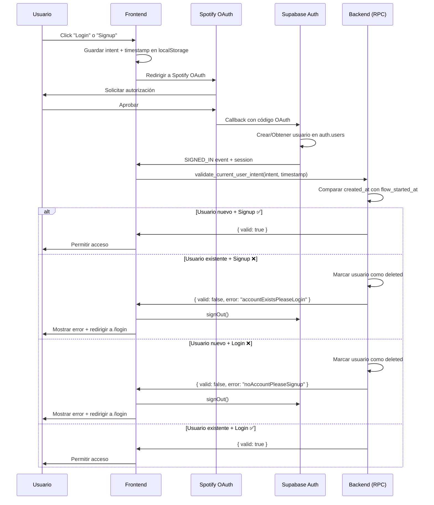

# Validación de Intent de Autenticación (Login vs Signup)

## 🎯 Problema Resuelto

Anteriormente, tanto el botón de "Login" como el de "Signup" terminaban registrando usuarios, porque **OAuth no distingue entre un usuario nuevo y uno existente** - simplemente autentica al usuario con el proveedor (Spotify) y retorna su identidad.

### ¿Por qué pasaba esto?

1. **OAuth es solo autenticación**: Verifica que el usuario es quien dice ser
2. **No hay "registro" en OAuth**: El proveedor (Spotify) solo confirma la identidad
3. **Supabase crea usuarios automáticamente**: Si el usuario no existe, lo crea

## 🔧 Solución Implementada

### Arquitectura de la Solución

La validación ahora ocurre en **3 etapas**:

```
Frontend (Inicio)  →  Backend (Validación)  →  Frontend (Resultado)
     ↓                      ↓                       ↓
1. Guarda intent      2. Compara timestamps    3. Acepta/Rechaza
   y timestamp           en base de datos         según validación
```

### Componentes Implementados

#### 1. **Backend: Tabla `auth_intents`** (Opcional - para tracking)
```sql
CREATE TABLE public.auth_intents (
  id uuid PRIMARY KEY,
  state_token text UNIQUE,
  intent text CHECK (intent IN ('login', 'signup')),
  email text,
  created_at timestamptz,
  expires_at timestamptz,
  consumed boolean
);
```

#### 2. **Backend: Función RPC `validate_current_user_intent`**

Esta es la **función clave** que hace la validación:

```sql
CREATE FUNCTION public.validate_current_user_intent(
  p_intent text,                    -- 'login' o 'signup'
  p_flow_started_at timestamptz     -- Cuando se inició el flujo OAuth
) RETURNS jsonb
```

**Lógica de validación:**

1. Obtiene el usuario autenticado actual (`auth.uid()`)
2. Lee `created_at` del usuario desde `auth.users`
3. Compara timestamps:
   - **Usuario nuevo**: `created_at` es cercano a `flow_started_at` (±3 minutos)
   - **Usuario existente**: `created_at` es anterior a `flow_started_at` (más de 10s antes)

4. **Valida conflictos:**
   - ❌ **Signup + Usuario existente** → Error: "La cuenta ya existe, usa Login"
   - ❌ **Login + Usuario nuevo** → Error: "No tienes cuenta, usa Signup"
   - ✅ **Signup + Usuario nuevo** → OK
   - ✅ **Login + Usuario existente** → OK

5. Si hay error, marca el usuario para eliminación (`deleted_at = now()`)

#### 3. **Frontend: Servicio `authIntentService.js`**

```javascript
export async function validateCurrentUserIntent(intent, flowStartedAtTimestamp) {
  const { data, error } = await supabase.rpc('validate_current_user_intent', {
    p_intent: intent,
    p_flow_started_at: new Date(flowStartedAtTimestamp).toISOString()
  });
  
  return data; // { valid, error, should_logout }
}
```

#### 4. **Frontend: Actualización en `LoginTemplate.jsx`**

Antes de iniciar OAuth, guarda el **timestamp e intent**:

```javascript
const handleSpotifyLogin = async () => {
  localStorage.setItem('authMode', 'login');
  localStorage.setItem('authTimestamp', Date.now().toString());
  
  await supabase.auth.signInWithOAuth({
    provider: "spotify",
    options: {
      queryParams: { show_dialog: 'false' } // No forzar diálogo
    }
  });
};

const handleSpotifySignup = async () => {
  localStorage.setItem('authMode', 'signup');
  localStorage.setItem('authTimestamp', Date.now().toString());
  
  await supabase.auth.signInWithOAuth({
    provider: "spotify",
    options: {
      queryParams: { show_dialog: 'true' } // Forzar selección de cuenta
    }
  });
};
```

#### 5. **Frontend: Validación en `App.jsx`**

Después de que OAuth complete (`SIGNED_IN`), valida con el backend:

```javascript
supabase.auth.onAuthStateChange(async (event, session) => {
  if (event === 'SIGNED_IN' && session) {
    const authMode = localStorage.getItem('authMode');
    const authTimestamp = localStorage.getItem('authTimestamp');
    
    if (authMode && authTimestamp) {
      // Llamar al backend para validar
      const validation = await validateCurrentUserIntent(
        authMode,
        parseInt(authTimestamp)
      );

      if (!validation.valid) {
        // Mostrar error y cerrar sesión
        localStorage.setItem('authError', validation.error);
        await supabase.auth.signOut();
        window.location.replace('/login');
        return;
      }

      // Limpiar y continuar
      localStorage.removeItem('authMode');
      localStorage.removeItem('authTimestamp');
    }
    
    setUser(session.user);
  }
});
```

## 🔒 Ventajas de Esta Solución

### ✅ Seguridad
- **Validación en el backend**: No se puede manipular desde el cliente
- **Timestamps del servidor**: No depende del reloj del cliente
- **Eliminación automática**: Usuarios inválidos se marcan como `deleted_at`

### ✅ Experiencia de Usuario
- **Mensajes claros**: 
  - "Esta cuenta ya existe, por favor usa Login"
  - "No tienes una cuenta, por favor usa Signup"
- **UX diferenciada**:
  - Login: No fuerza diálogo de Spotify (más rápido)
  - Signup: Fuerza selección de cuenta (más seguro)

### ✅ Robustez
- **Maneja edge cases**: 
  - Relogin rápido
  - Cambio de cuenta durante OAuth
  - Timeouts del flujo OAuth
- **Logging completo**: Todos los pasos se registran en Postgres logs
- **Compatible con flujos antiguos**: Si no hay intent, permite continuar

## 📊 Flujo Completo



## 🧪 Testing

### Casos de Prueba

1. **✅ Signup con cuenta nueva**
   - Usuario no existe → Crea cuenta → Éxito

2. **❌ Signup con cuenta existente**
   - Usuario existe → Intenta signup → Error → Redirige a login

3. **✅ Login con cuenta existente**
   - Usuario existe → Hace login → Éxito

4. **❌ Login sin cuenta**
   - Usuario no existe → Intenta login → Error → Redirige a signup

5. **✅ Relogin rápido**
   - Usuario hace login → Sale → Vuelve a login rápido → Éxito

### Logs para Debugging

La función RPC genera logs detallados en Postgres:

```sql
-- Ver logs de validación
SELECT * FROM postgres_logs
WHERE message LIKE '%Validando intent%'
ORDER BY timestamp DESC
LIMIT 20;
```

## 🔍 Monitoreo

### Métricas Importantes

1. **Intentos de signup con cuenta existente**
   ```sql
   SELECT COUNT(*) FROM auth.users
   WHERE raw_user_meta_data->>'auth_error' = 'accountExistsPleaseLogin'
   AND deleted_at > now() - interval '7 days';
   ```

2. **Intentos de login sin cuenta**
   ```sql
   SELECT COUNT(*) FROM auth.users
   WHERE raw_user_meta_data->>'auth_error' = 'noAccountPleaseSignup'
   AND deleted_at > now() - interval '7 days';
   ```

## 🚀 Deployment

### Aplicar Migraciones

Las migraciones ya están aplicadas en tu proyecto:
- ✅ `create_auth_intent_table`
- ✅ `create_auth_validation_function`
- ✅ `simplified_auth_intent_with_metadata`
- ✅ `auth_intent_validation_final`

### Verificar Instalación

```sql
-- Verificar que la función existe
SELECT * FROM pg_proc 
WHERE proname = 'validate_current_user_intent';

-- Verificar permisos
SELECT grantee, privilege_type
FROM information_schema.routine_privileges
WHERE routine_name = 'validate_current_user_intent';
```

## 🐛 Troubleshooting

### Error: "Intent not found"
- **Causa**: localStorage fue limpiado antes de la validación
- **Solución**: La validación permite continuar en este caso (compatibilidad)

### Error: "User not found"
- **Causa**: El usuario fue eliminado entre OAuth y validación
- **Solución**: Hacer signOut() y reintentar

### Validación incorrecta por timezone
- **Causa**: Diferencia entre timezone del cliente y servidor
- **Solución**: Siempre usar ISO timestamps (ya implementado)

## 📝 Notas Importantes

1. **No se puede prevenir la creación del usuario**: OAuth de Supabase siempre crea el usuario si no existe. La validación ocurre DESPUÉS y marca para eliminación si es inválido.

2. **Soft delete**: Los usuarios inválidos se marcan con `deleted_at`, no se eliminan físicamente de inmediato.

3. **Cleanup automático**: Considera crear un job que limpie usuarios marcados como `deleted` después de 24h.

4. **Compatibilidad**: El sistema sigue funcionando sin intent (para flujos antiguos o casos edge).

## 📚 Referencias

- [Supabase Auth Documentation](https://supabase.com/docs/guides/auth)
- [OAuth 2.0 Flow](https://oauth.net/2/)
- [Spotify OAuth Guide](https://developer.spotify.com/documentation/general/guides/authorization-guide/)
