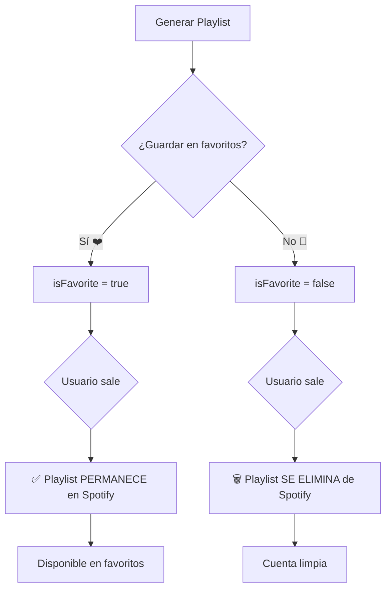

# 🧹 Auto-limpieza de Playlists No Guardadas

## 🎯 Problema Resuelto

**Antes**: Si un usuario generaba playlists de prueba sin guardarlas, se acumulaban en su cuenta de Spotify.

**Ahora**: Las playlists se eliminan automáticamente de Spotify si el usuario sale sin guardarlas.

## ✨ Comportamiento del Sistema

```
┌─────────────────────────────────────────────────────┐
│  Usuario genera playlist                             │
│                                                       │
│  ┌─────────────────┐                                 │
│  │ Generar Playlist│                                 │
│  └────────┬────────┘                                 │
│           │                                           │
│           ▼                                           │
│  ┌──────────────────────────────────────┐            │
│  │  Playlist creada en Spotify          │            │
│  │  ID: 7xyz123...                      │            │
│  └──────────────┬───────────────────────┘            │
│                 │                                     │
│        ┌────────┴────────┐                           │
│        │                 │                           │
│        ▼                 ▼                           │
│  ┌──────────┐     ┌──────────────┐                  │
│  │ Guardar  │     │ NO Guardar   │                  │
│  │ (❤️)     │     │              │                  │
│  └────┬─────┘     └─────┬────────┘                  │
│       │                 │                            │
│       ▼                 ▼                            │
│  ✅ Permanece      🗑️ Se elimina                    │
│  en Spotify         automáticamente                 │
│  y en favoritos     al salir                        │
└─────────────────────────────────────────────────────┘
```

## 🔄 Flujos de Auto-limpieza

### 1️⃣ Usuario hace clic en "Volver"

```javascript
const handleBack = async () => {
  // Detectar si hay playlist sin guardar
  if (generatedPlaylist && !isFavorite && spotifyAccessToken) {
    console.log('🗑️ Eliminando playlist no guardada...');
    await spotifyService.deletePlaylist(generatedPlaylist.id, spotifyAccessToken);
  }
  navigate('/home');
};
```

**Trigger**: Click en botón "← Volver"  
**Acción**: Elimina de Spotify antes de navegar  
**Resultado**: Cuenta de Spotify limpia  

### 2️⃣ Usuario navega a otra página

```javascript
useEffect(() => {
  return () => {
    // Cleanup al desmontar componente
    if (generatedPlaylist && !isFavorite && spotifyAccessToken) {
      (async () => {
        await spotifyService.deletePlaylist(generatedPlaylist.id, spotifyAccessToken);
      })();
    }
  };
}, [generatedPlaylist, isFavorite, spotifyAccessToken]);
```

**Trigger**: Navegación a otra ruta, cierre de pestaña, etc.  
**Acción**: Cleanup automático  
**Resultado**: No quedan playlists huérfanas  

## 📋 Condiciones para Auto-limpieza

Para que una playlist se elimine automáticamente, deben cumplirse **TODAS** estas condiciones:

| Condición | Descripción |
|-----------|-------------|
| ✅ `generatedPlaylist !== null` | Hay una playlist generada |
| ✅ `isFavorite === false` | NO está guardada en favoritos |
| ✅ `spotifyAccessToken !== null` | Hay token válido de Spotify |

Si **alguna** condición no se cumple, la playlist NO se elimina.

## 🛡️ Protección de Favoritos

```javascript
// ✅ Playlist guardada (isFavorite = true)
if (isFavorite) {
  // NO se elimina automáticamente
  // Solo con acción manual del usuario
}

// 🗑️ Playlist NO guardada (isFavorite = false)
if (!isFavorite) {
  // Se elimina al salir
  deletePlaylist(playlistId);
}
```

## 🎨 Experiencia de Usuario

### Caso 1: Usuario Explora y Sale
```
1. Usuario genera playlist
2. La escucha un poco
3. No le gusta
4. Hace clic en "Volver"
5. ✨ Playlist eliminada automáticamente
6. Cuenta de Spotify limpia
```

### Caso 2: Usuario Guarda Playlist
```
1. Usuario genera playlist
2. Le gusta
3. Hace clic en "❤️ Guardar en favoritos"
4. Hace clic en "Volver"
5. ✅ Playlist permanece en Spotify
6. Disponible en favoritos
```

## 🔍 Logs del Sistema

### Eliminación en handleBack
```
🗑️ Eliminando playlist no guardada de Spotify...
✅ Playlist eliminada de Spotify
```

### Limpieza en useEffect cleanup
```
🧹 Limpiando playlist no guardada al salir...
✅ Playlist limpiada exitosamente
```

### Error (continúa navegando)
```
⚠️ Error eliminando playlist de Spotify: [mensaje]
```

## 🎯 Ventajas

| Ventaja | Descripción |
|---------|-------------|
| 🧹 **Cuenta Limpia** | Solo playlists deseadas permanecen |
| ⚡ **Automático** | No requiere acción del usuario |
| 🎨 **Mejor UX** | Usuario no se preocupa por limpieza |
| 💾 **Espacio** | No se acumulan playlists innecesarias |
| 🔒 **Seguro** | Solo elimina las NO guardadas |

## 🚨 Importante

- **Solo se eliminan playlists NO guardadas en favoritos**
- **Las playlists favoritas están 100% protegidas**
- **La eliminación es silenciosa (no muestra confirmación)**
- **Si falla, continúa navegando normalmente**

## 📊 Comparación: Antes vs Ahora

### ❌ Antes
```
Usuario genera 10 playlists de prueba
→ 10 playlists en Spotify
→ Solo usa 2
→ 8 playlists acumuladas sin usar
```

### ✅ Ahora
```
Usuario genera 10 playlists de prueba
→ Guarda 2 en favoritos
→ Sale de las otras 8
→ 8 playlists eliminadas automáticamente
→ Solo 2 playlists en Spotify (las que quería)
```

## 🎬 Flujo Completo



---

## 📝 Resumen

**Auto-limpieza inteligente** que mantiene la cuenta de Spotify del usuario organizada, eliminando automáticamente las playlists generadas que no fueron guardadas en favoritos.

